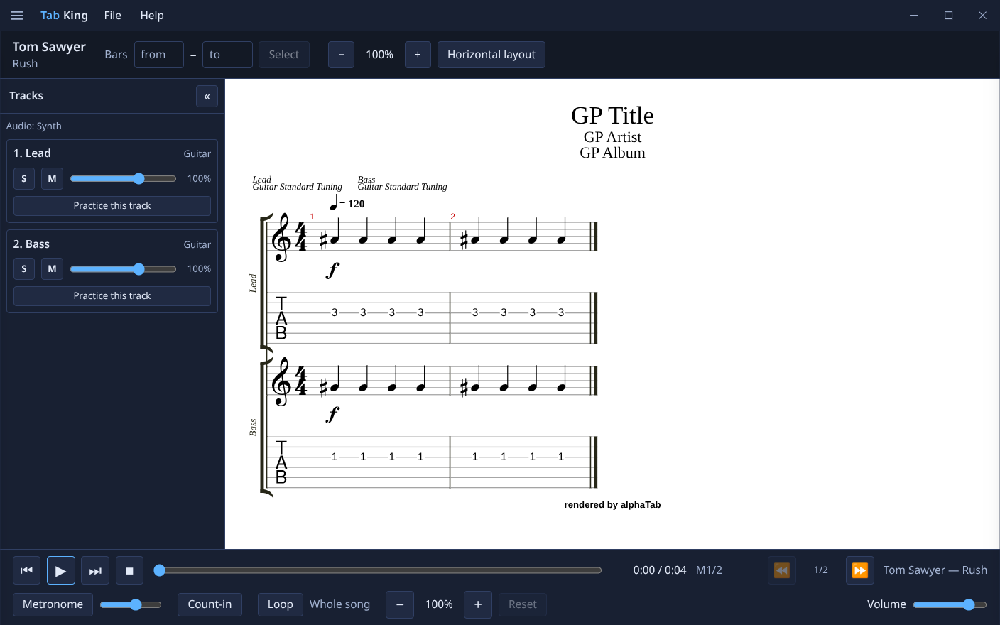
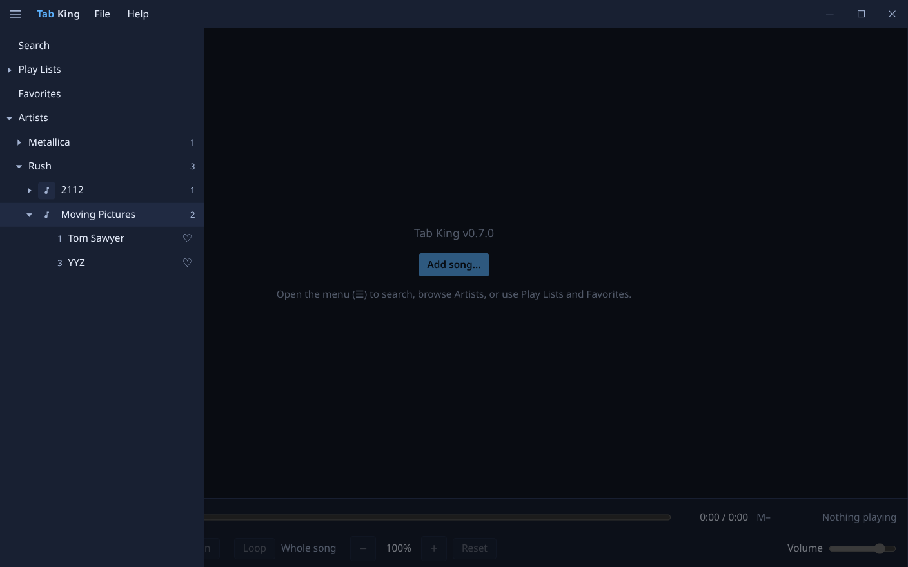
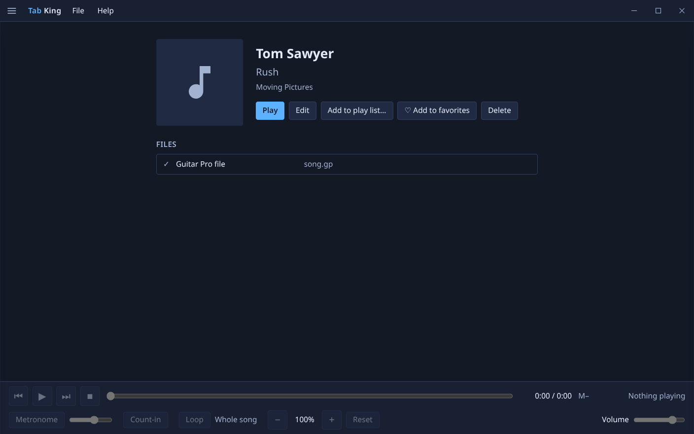
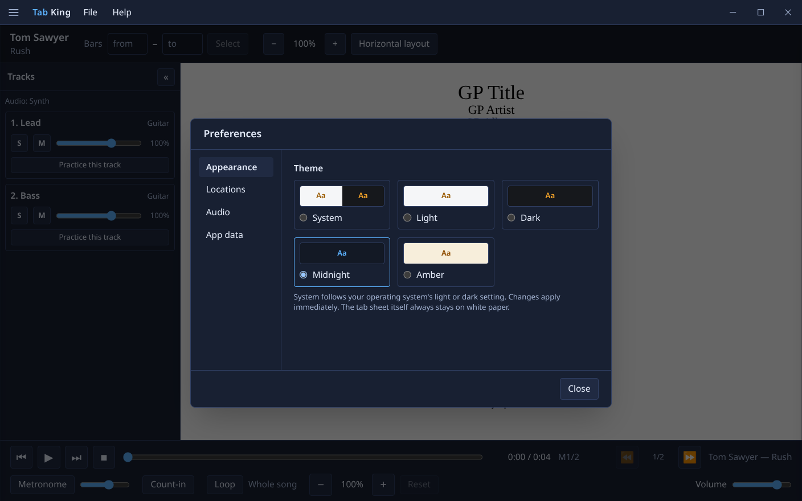
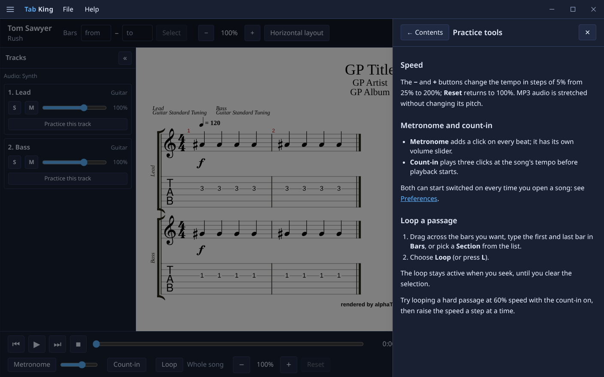

# Tab King

A desktop guitar tab player in the spirit of [Songsterr](https://www.songsterr.com/): load Guitar Pro files, play them with a synth or with synced MP3 tracks, loop sections, slow them down, and practice.

Single-user, offline-first, open source (Apache-2.0).

> Status: **v1.0** — a complete offline tab player. See [CHANGELOG.md](CHANGELOG.md) for what each release added and [docs/](docs/) for the design.



## Features

- Guitar Pro (GP3–GP8) tab and notation rendering with a scrolling cursor
- Synth playback with speed control (25–200%); per-track mute, solo and volume; practice one track at a time
- A master MP3 plus optional per-instrument MP3 stems, kept in step with the tab by a start offset and bar sync points (pitch is preserved when you slow down)
- Metronome, 3-click count-in, select-and-loop of bars or sections
- A library built from ID3 tags (cover art, artist, album, title) with Search, Play Lists, Favorites and Artist → Album → Song browsing; albums and play lists play through
- Themes (system, light, dark, midnight, amber), configurable library and backup folders, audio output and SoundFont choice
- Backup and restore to a single .zip, built-in help, and an update check against GitHub Releases that only runs when you ask
- Frameless window with its own menu bar; keyboard-operable throughout

| Library                                           | Song page                                   |
| ------------------------------------------------- | ------------------------------------------- |
|  |    |
|   |  |

## Install

Download the file for your system from the [latest release](https://github.com/pacificnm/tab-king/releases/latest) and check it against `SHA256SUMS.txt` if you like.

| System              | File                                                    | Notes                                                                  |
| ------------------- | ------------------------------------------------------- | ---------------------------------------------------------------------- |
| Linux x64           | `…-linux-x86_64.AppImage` or `…-linux-amd64.deb`        | AppImage: `chmod +x` it and run it. Deb: `sudo apt install ./file.deb` |
| Linux ARM64 (Pi 5)  | `…-linux-arm64.AppImage` or `…-linux-arm64.deb`         | Same as above                                                          |
| Windows             | `…-win-x64.exe` (installer) or `…-win-x64-portable.exe` | See the SmartScreen note below                                         |
| macOS Apple silicon | `…-mac-arm64.dmg` (or `.zip`)                           | See the Gatekeeper note below                                          |
| macOS Intel         | `…-mac-x64.dmg` (or `.zip`)                             | See the Gatekeeper note below                                          |

**The 1.0 builds are not code-signed** (certificates cost money and this is a hobby project), so your system will warn you the first time:

- **Windows SmartScreen** says "Windows protected your PC": choose **More info → Run anyway**.
- **macOS** says the app "can't be opened because Apple cannot check it": Control-click the app, choose **Open**, then **Open** again. If macOS still refuses (for example on a downloaded .zip), run `xattr -dr com.apple.quarantine "/Applications/Tab King.app"` once.
- **Linux AppImage** needs FUSE 2 on some distributions (`sudo apt install libfuse2` on Ubuntu 22.04+).

Your songs, play lists and settings stay on your computer. Tab King makes no network connection unless you press **Help → About → Check for updates**.

## Stack

Electron · React · TypeScript · Tailwind CSS · SQLite (better-sqlite3) · alphaTab · Vite

## Platforms

Linux (x64, ARM64), Windows, macOS.

## Documentation

| Doc                                          | Purpose                                                    |
| -------------------------------------------- | ---------------------------------------------------------- |
| [docs/REQUIREMENTS.md](docs/REQUIREMENTS.md) | What the app must do (numbered, testable)                  |
| [docs/SPECS.md](docs/SPECS.md)               | How it is built: architecture, data model, UI, sync design |
| [docs/PROJECT_PLAN.md](docs/PROJECT_PLAN.md) | Phased plan, branch/merge/tag workflow                     |
| [CLAUDE.md](CLAUDE.md)                       | Guidance for Claude Code working in this repo              |
| [docs/QA.md](docs/QA.md)                     | Manual QA checklist run before each release                |
| [PROMPT.md](PROMPT.md)                       | Original project brief                                     |

## Development

Requires Node 22 (see `.nvmrc`).

```bash
npm install
npm run dev          # run with hot reload
npm test             # unit tests (Vitest)
npm run test:e2e     # Electron end-to-end tests (Playwright; needs a display)
npm run lint && npm run typecheck
npm run license:check # production dependencies must be Apache-2.0-compatible
npm run dist:dir     # unpacked package for the host platform
npm run dist         # installers for the host platform
```

If you launch from an Electron-hosted terminal (e.g. VS Code), `unset ELECTRON_RUN_AS_NODE` first.

Releases: bump `version` in `package.json`, add a `CHANGELOG.md` section, then push a matching `vX.Y.Z` tag. The release workflow builds Linux (x64, arm64), Windows (x64) and macOS (x64, arm64) and publishes a GitHub Release.

## License

[Apache License 2.0](LICENSE). Third-party notices are in [NOTICE](NOTICE) and the full list of bundled packages with their licenses in [THIRD_PARTY_LICENSES.md](THIRD_PARTY_LICENSES.md) (checked in CI by `npm run license:check`): alphaTab (MPL-2.0), Electron (MIT), React (MIT), the bundled Sonivox SoundFont (Apache-2.0) and Bravura font (SIL OFL).
